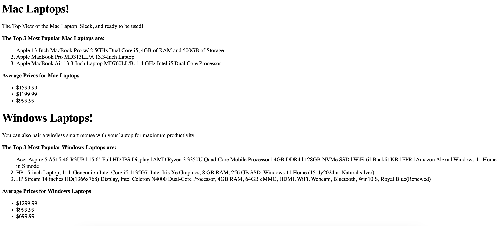
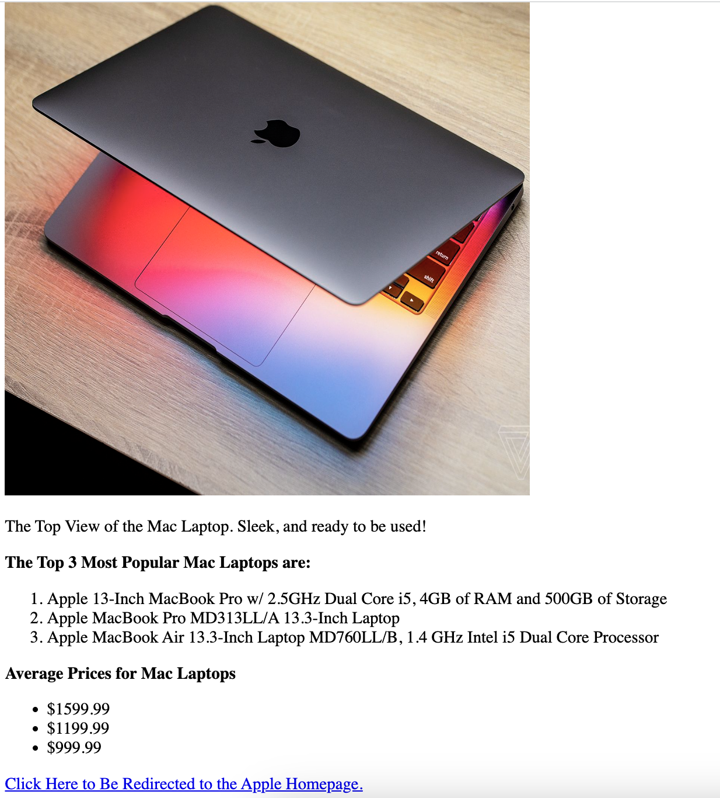
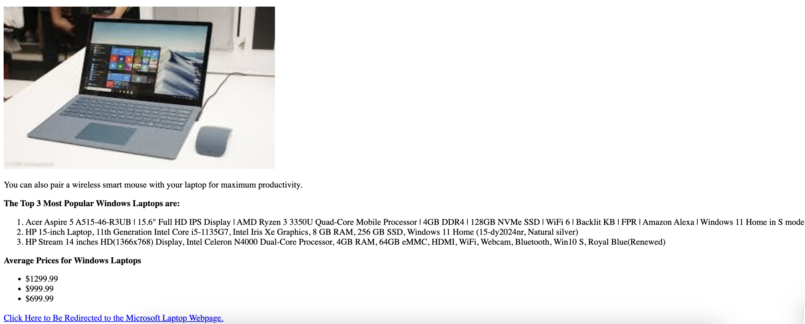

# Mac and Windows
**TASK**: Design a page that marks up some content, and will display information about Mac and Windows. The final page should look similar in structure to the one shown below:

## Project Specs
1. Create some boilerplate HTML in your index.html file.
2. Give your page a `<title>`
3. Create a `<h1>` tag of your choice to grab the users attention to the Mac or Windows
4. Create a subtitle for both Apple and Windows your page using your choice of `<h2>` through `<h6>` tags. 
5. Include a `
` element under each subtile describing the laptops you will be showcasing.
6. Include an `<ol>` element of the top 3 laptops for each branch.
7. Include an `<ul>` element with 3 prices of your laptops. These prices could be based on a real product or could be made up
8. Use a `<strong>` tag to bold some of the text. [Check out the docs](https://www.w3schools.com/tags/tag_strong.asp) if you don't know how to use this!
9. Commit and push your final work back to GitHub!

## Stretch Tasks 🚀
1. Find 3 images of Mac or Windows Laptops and add these files to your project folder.
2. Render each of the images using an `` tag. Be sure to add `alt` attribute to each describing what the image is.
    - [`` Tag Docs](https://www.w3schools.com/tags/tag_img.asp)
3. Include an `<a>` tag to Apple's Website or Microsoft Website 
    - [`<a>` Tag Docs](https://www.w3schools.com/tags/tag_a.asp)
4. Create two `
` elements in your page that wrap around each of your sections. One for Mac and one for Windows:
    - Create one `
` with `id="mac"` and one `
` with `id="windows"`
    - Give each `
` a class of `"laptops"`
    - [`
` Tag Docs](https://www.w3schools.com/tags/tag_div.asp)
    - [HTML Class Attribute Docs](https://www.w3schools.com/html/html_classes.asp)
    - [HTML ID Attribute Docs](https://www.w3schools.com/html/html_id.asp)

